# Lite3 强化学习训练文档

本文合并原「强化学习算法训练 Guide」与「Dreamwaq Lite3 学习笔记」，面向 **Isaac Gym / Dreamwaq 训练侧**（非本仓库实机部署）。

实机交叉编译、部署与遥控用法见同目录 [`实机项目.md`](./实机项目.md)。

---

## 目录

1. [训练环境与技能指南](#第一部分训练环境与技能指南)（后空翻、跳跃等调参与流程）
2. [Dreamwaq / Lite3 概念笔记](#第二部分dreamwaq--lite3-概念笔记)（观测维度、奖励、配置陷阱等）
3. [MuJoCo 仿真背负质量块](#mujoco-仿真背负质量块与实机盒子对齐)

图片资源目录：`训练项目.assets/`

---

# 第一部分：训练环境与技能指南


## 训练环境

- 双 5090 系显卡，显卡驱动版本为 580.159.03
- PyTorch 版本为 2.4.1+cu121，使用 CUDA 12.1
- Python 版本为 3.8.20，numpy 固定为 1.23.5（Isaac Gym 依赖 `np.float`，1.24+ 已移除）
- 基于 dreamwaq 训练框架

## 一、后空翻

1. 基于 dreamwaq 训练框架，后空翻参考 [Genesis-backflip](https://github.com/ziyanx02/Genesis-backflip) 奖励函数
2. 修改 asset 参数，将内部参数更改为 lite3 的相关参数

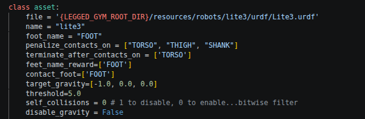

实机背上有控制盒，Isaac 训练 asset 与 MuJoCo 仿真模型都应对齐该负载，见下文 [MuJoCo 仿真背负质量块](#mujoco-仿真背负质量块与实机盒子对齐)。

3. 添加关键奖励函数

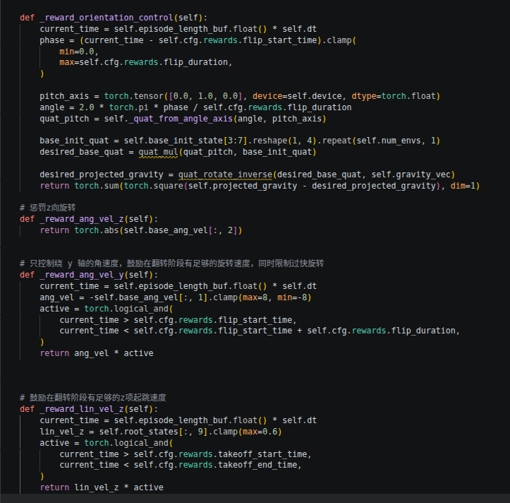

其中包括：

- a. 姿态控制奖励（`_reward_orientation_control`）：使机器人能够在空中翻转 360 度
- b. z 向旋转控制（`_reward_ang_vel_z`）：惩罚机器人 z 向旋转
- c. y 向旋转速度（`_reward_ang_vel_y`）：鼓励在翻转阶段有足够的旋转速度，同时限制过快旋转
- d. 鼓励起跳速度（`_reward_lin_vel_z`）：使机器人能够在初期起跳完成后空翻动作

4. 添加后空翻动作时间节点以及起跳前高度以及落地后的高度控制参数

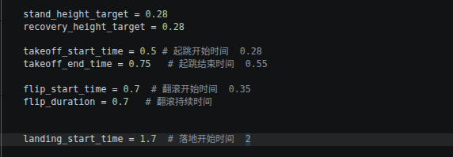

5. 配置训练参数（参考 [Genesis-backflip](https://github.com/ziyanx02/Genesis-backflip) 基本参数设置，并根据 play 的表现，进行调参）

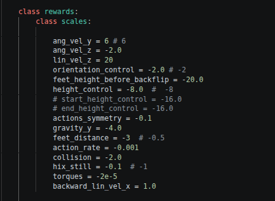

### 5.1 强化学习调参经验（后空翻奖励）

后空翻奖励项多、正负并存。策略优化的是**总回报**，不是某一项；正项太弱时，翻转在总回报里像噪声，策略会学成「少动少罚」。调参时优先保证「能翻起来」，再收紧姿态与平滑性。

有 [Genesis-backflip](https://github.com/ziyanx02/Genesis-backflip) 可用初值时：**先全开复现**；学不动再按层做 ablation，而不是从零逐个发明权重。

#### 推荐工作流（不要误解成分层各训满 5000）

分层是**排查 / 摸索权重**的思路，不是「每层从零再训满 5000」。

| 情况 | 做法 |
|------|------|
| 已有 Genesis 初值（当前默认） | **全开**直接长训（如 3000–5000）；能翻再微调 |
| 全开学不动 / 正奖励被淹 | 减弱后两层惩罚，或只留核心三项做短程 ablation |
| 从零摸权重 | 核心三项短程（500–1500）→ 有苗头后 **resume 续训** 再开下一层 → 最终配置再拉长到 5000 |

不建议：每加一组奖励就从零重训满 5000（太慢、难对比）；也不建议只跑几十步就下结论。

#### 分层打开顺序（从零探索或 ablation 时）

1. **先开「会翻」的三项（任务本体 / 正信号）**
   - `lin_vel_z`：起跳窗内奖励向上速度
   - `ang_vel_y`：翻转窗内奖励 pitch 角速度
   - `orientation_control`：跟踪期望 pitch 轨迹（姿态是否跟时间表）
   - **目标**：是否开始蹬地、绕 y 转、大致跟姿态轨迹。这三项关着，其它惩罚再准也学不会后空翻。

2. **再加「别歪 / 别提前飞」的约束**
   - `ang_vel_z`、`gravity_y`：抑制 yaw 扭转与 roll 侧倾
   - `feet_height_before_backflip`、`height_control`：prepare 贴地、高度稳定
   - **目标**：翻转更干净，prepare 段更稳。

3. **最后加平滑 / 对称**
   - `actions_symmetry`、`feet_distance`、`action_rate`
   - **目标**：更好部署、更少抖动；对「会不会翻」的影响通常小于前两组。

#### 为什么正奖励被淹会导致学不起来

每步回报大致为 `r = 正项合计 + 负项合计`，PPO 用总回报算「哪些动作更好」。

- 若 `height_control`、`feet_height_before_backflip` 等惩罚绝对值远大于起跳 / 翻转正项，则 `r` 几乎只反映惩罚。
- 起跳往往立刻带来大惩罚（高度偏离、脚离地），蹲着不动总回报反而更好 → 策略收敛到「别动」。
- 偶发翻转在采样里又稀又弱，梯度主要在减小惩罚，而不是增大翻转。

**本质**：不是模型笨，而是目标函数在鼓励别翻。

#### 「全开学不动 / 正奖励被淹」有什么表现

**分项曲线（最关键）：**

- `Episode/rew_lin_vel_z`、`rew_ang_vel_y`、`rew_orientation_control` 长期接近 0、几乎不涨
- 同时高度 / 贴地 / 侧倾等惩罚项绝对值很大、占主导
- 总 `Train/mean_reward` 一直很负或小幅抖但上不去（只看总 reward 容易误判）

**play / 视频：**

- 一直蹲着抖、不起跳；或抬一点又被拉回
- 有起跳但不绕 y 翻，或乱扭侧倒
- 跑满 episode 但像「原地罚站」，没有翻转阶段

**其它：**

- `Policy/mean_noise_std` 很快塌掉，探索消失
- 几千 iter 后 play 仍接近随机策略

与「能翻但粗糙」的区别：正项分项已明显非零且有趋势，只是歪、抖、落地差 → 应保留正项，调对称 / 平滑，而不是再砍核心奖励。

#### 为什么不建议一上来「十个旋钮一起拧」

- 项一多，说不清哪一项在拖后腿（尤其负项淹没正项时）。
- 「全开微调」适合**已经能翻、只是粗糙**；从零摸权重应用分层 / ablation。
- 有可信初值时例外：先全开复现，比从零发明更快。

#### 实操清单

- 每次只改 **1–2 个 scale**，跑固定短程（如 500–1000）再对比。
- **先看分项**：`rew_lin_vel_z` / `rew_ang_vel_y` / `rew_orientation_control`；总 `mean_reward` 作辅证。
- **量级原则**：翻转窗内正项要能压过惩罚；惩罚过大就先降惩罚，而不是猛加正项到不稳定。
- 分层有苗头后用 **`--resume`** 续训加项，避免反复从零 5000。
- 训过约 500–1000 iter：若三项正奖励仍贴零且惩罚很大 → 按「被淹」处理。

**一句话**：有 Genesis 初值就先全开长训；学不动再按「核心 → 稳定 → 平滑」减弱惩罚或短程 ablation + resume；正项必须在总回报里「看得见」，否则策略只会学少动。

6. 添加注册表配置

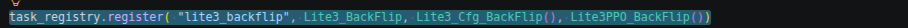

7. 启动训练

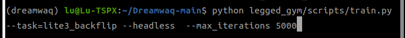

前期先训 5000 回合看效果。

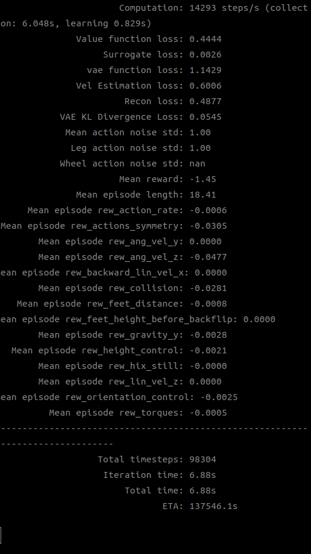

在 `Dreamwaq_Lite3/legged_gym` 目录下启动训练：

```bash
cd Dreamwaq_Lite3/legged_gym
conda activate OHD

python legged_gym/scripts/train.py --task=lite3_backflip --headless --max_iterations 5000
```

说明：

- 参数名是 **`--max_iterations`**（带 s），不是 `--max_iteration`。
- 日志与 checkpoint 保存在 `logs/backflip_lite3/<日期时间_run名>/`（如 `model_50.pt`、`model_5000.pt`）。
- 正常结束时目录内应有 **`model_5000.pt`**。

### 7.1 使用 tmux 防止 SSH 断开中断训练（推荐）

通过 SSH 在服务器上训练时，若 Windows 锁屏后睡眠/断网、或 Cursor/SSH 终端关闭，**未保活的训练进程会随 shell 一起退出**。建议在服务器上用 **tmux** 跑训练：tmux 在服务器上维护独立的终端会话，与客户端 SSH 是否连接无关。

```bash
# 新建名为 train 的 tmux 会话（若已存在同名会话，见下方说明）
tmux new -s train

# 在 tmux 会话内
conda activate OHD
cd Dreamwaq_Lite3/legged_gym
python legged_gym/scripts/train.py --task=lite3_backflip --headless --max_iterations 5000

# 脱离会话（训练继续跑）：先按 Ctrl+B，松开后按 D
```

常用操作：

```bash
tmux ls                  # 查看已有会话
tmux attach -t train     # 重新连回 train 会话看日志
# 在 attach 状态下再次 Ctrl+B 然后 D 可再次 detach
```

注意：

- 若提示 **`duplicate session: train`**，说明同名会话已存在，用 `tmux attach -t train` 连回即可，或 `tmux kill-session -t train` 删掉旧会话后再 `tmux new -s train`。
- `conda activate OHD` 后可能出现 `libtinfo.so.6: no version information available`，一般为 conda 库与系统 shell 的警告，**可忽略**，不影响训练。

### 7.2 从 checkpoint 续训

训练中断（如 SSH 断开）后，可从已有 run 的 checkpoint 接着训：

```bash
cd Dreamwaq_Lite3/legged_gym
conda activate OHD

python legged_gym/scripts/train.py --task=lite3_backflip --headless \
  --max_iterations 5000 --resume \
  --load_run=Jun29_21-17-31_ --checkpoint=1700
```

说明：

- **`--resume`**：从 checkpoint 加载模型权重与 iteration 计数。
- **`--load_run`**：原训练 run 目录名（`ls logs/backflip_lite3/` 查看）。
- **`--checkpoint`**：要加载的 iteration 编号（对应 `model_1700.pt` 则写 `1700`）。
- 续训时 **`--max_iterations` 表示从 checkpoint 起再训练多少轮**（不是总目标轮数）。例如从 1700 续到总共 5000 轮，应写 **`--max_iterations 3300`**（5000 − 1700）。
- 续训会**新建**一个 run 目录保存后续 checkpoint，权重从指定旧 run 加载。
- 建议在 **tmux 会话内**执行续训命令，避免再次因 SSH 断开中断。

### 7.3 查看训练日志与导出曲线图

每次训练的日志保存在：

```text
Dreamwaq_Lite3/legged_gym/logs/backflip_lite3/<日期时间_run名>/
├── events.out.tfevents.*   # TensorBoard 曲线数据（二进制，勿当文本打开）
├── model_0.pt              # checkpoint
├── model_50.pt
└── ...
```

**方式 A：TensorBoard（浏览器交互）**

```bash
cd Dreamwaq_Lite3/legged_gym
tensorboard --logdir logs/backflip_lite3/<训练目录名> --bind_all --port 6006
```

本地 SSH 端口转发后浏览器打开 `http://localhost:6006`：

```bash
ssh -L 6006:localhost:6006 user@<服务器IP>
```

**方式 B：导出 PNG 曲线图（推荐，便于本地查看）**

项目提供脚本 `Dreamwaq_Lite3/tool/plot_tb.py`，从 `events.out.tfevents.*` 生成 PNG，无需开浏览器。

```bash
conda activate OHD
cd Dreamwaq_Lite3

# 默认导出常用指标到 <log_dir>/plots/
python tool/plot_tb.py legged_gym/logs/backflip_lite3/<训练目录名>

# 指定输出目录
python tool/plot_tb.py legged_gym/logs/backflip_lite3/<训练目录名> -o ./my_plots

# 列出该 run 内所有可用指标名
python tool/plot_tb.py legged_gym/logs/backflip_lite3/<训练目录名> --list-tags

# 只导出指定曲线
python tool/plot_tb.py legged_gym/logs/backflip_lite3/<训练目录名> \
  --tags Train/mean_reward Loss/surrogate
```

默认导出的曲线包括：`Train/mean_reward`、`Train/mean_episode_length`、`Loss/value_function`、`Loss/surrogate`、`Loss/autoenc_function`、`Policy/mean_noise_std`、`Perf/total_fps` 等。

输出示例：

```text
legged_gym/logs/backflip_lite3/<训练目录名>/plots/
├── Train_mean_reward.png
├── Loss_surrogate.png
└── ...
```

下载 PNG 到本地：

```bash
scp -r user@server:~/code/OHDog/Dreamwaq_Lite3/legged_gym/logs/backflip_lite3/<训练目录名>/plots ./
```

#### 如何查看 PNG 曲线图

`plots/` 下是普通图片文件（如 `Train_mean_reward.png`），**不要用文本方式打开**；用下面任一方式即可。

**方法 1：Cursor / VS Code 远程直接预览（最方便）**

工程已通过 Remote SSH 连到服务器时：

1. 在左侧文件树打开  
   `Dreamwaq_Lite3/legged_gym/logs/backflip_lite3/<训练目录名>/plots/`
2. **单击**任意 `.png` 文件（如 `Train_mean_reward.png`）
3. 编辑器中间会显示图片预览；可切换标签页对比多张曲线

**方法 2：下载到 Windows 本地后查看**

在 **本地 PowerShell / 终端** 执行（将路径换成你的 run 名）：

```bash
scp -r snh@192.168.1.239:~/code/OHDog/Dreamwaq_Lite3/legged_gym/logs/backflip_lite3/Jun30_10-31-07_/plots ./plots
```

然后在资源管理器中打开 `plots` 文件夹，双击 PNG，用系统照片/浏览器即可查看。

**方法 3：在服务器上用命令行确认文件已生成（不看图，仅核对）**

```bash
ls -lh legged_gym/logs/backflip_lite3/<训练目录名>/plots/
```

**各 PNG 大致含义（读图时关注什么）**

| 文件名 | 看什么 |
|--------|--------|
| `Train_mean_reward.png` | 平均 reward 是否总体上升、是否剧烈震荡 |
| `Train_mean_episode_length.png` | episode 是否过早终止（后空翻约 3s，长度应接近满 episode） |
| `Loss_surrogate.png` / `Loss_value_function.png` | loss 是否突然爆炸（可能预示 NaN） |
| `Loss_autoenc_function.png` | CENet 重建/速度估计是否稳定 |
| `Policy_mean_noise_std.png` | 探索噪声是否随训练下降 |
| `Perf_total_fps.png` | 训练吞吐是否正常 |

训练过程中可反复执行 `python tool/plot_tb.py ...` 覆盖生成最新曲线，再刷新 Cursor 里打开的 PNG 预览。

**方式 C：加载 checkpoint 元信息（非可视化）**

```bash
python -c "
import torch
ckpt = torch.load('legged_gym/logs/backflip_lite3/<训练目录名>/model_1700.pt', map_location='cpu')
print('iteration:', ckpt.get('iter'))
"
```

8. 在 gym 中 play 看训练效果

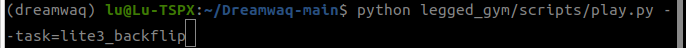

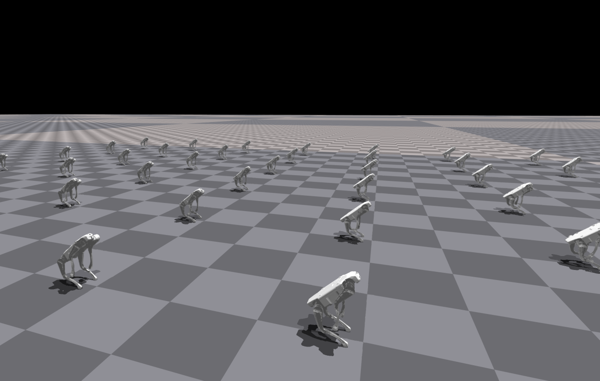

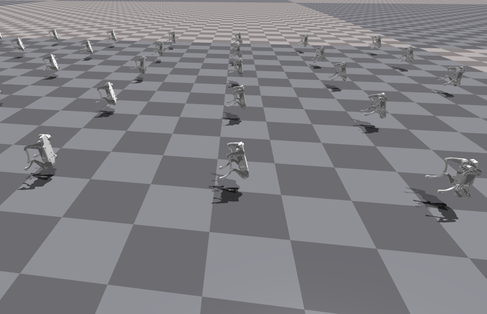

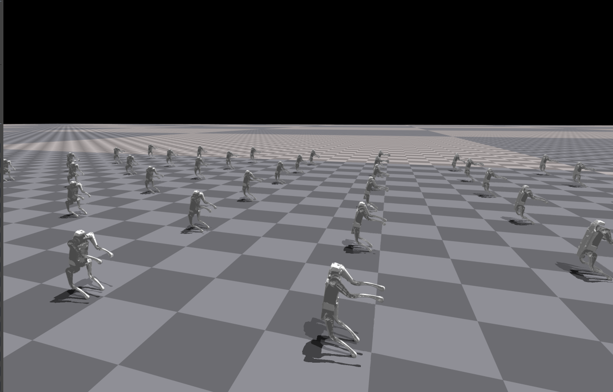

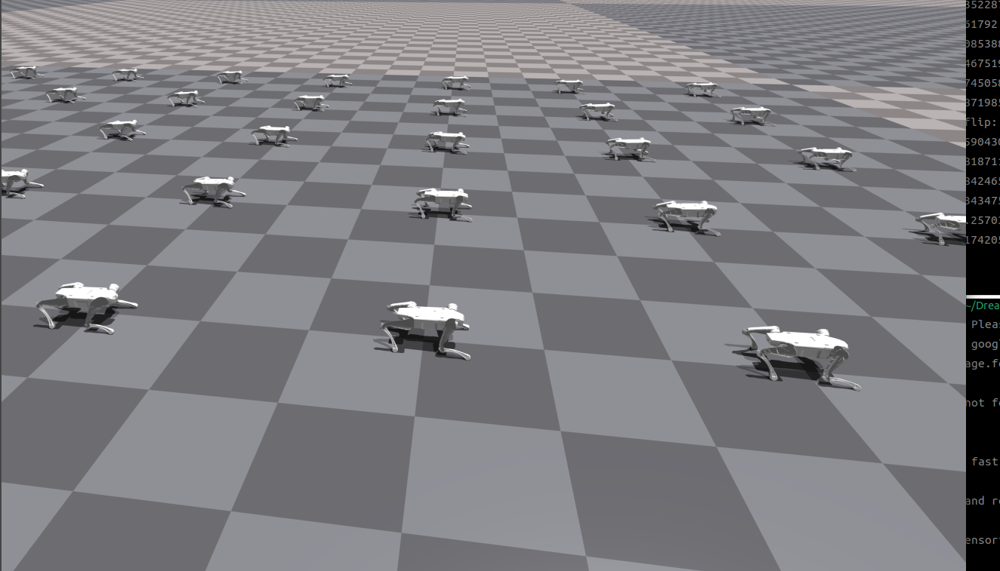

训练完成后，checkpoint 保存在 `Dreamwaq_Lite3/legged_gym/logs/backflip_lite3/<日期时间_run名>/` 下（如 `model_5000.pt`）。在 `legged_gym` 目录下执行 play 加载策略：

```bash
cd Dreamwaq_Lite3/legged_gym

# 查看有哪些训练 run
ls logs/backflip_lite3/

# 交互式查看（本地有显示器时；不要加 --headless）
python legged_gym/scripts/play.py --task=lite3_backflip --load_run=<训练目录名> --num_envs=1
```

说明：

- `play.py` 内已设置 `resume=True`，会自动加载 checkpoint；可用 `--checkpoint=5000` 指定 iteration，省略则加载该 run 下最新 `model_*.pt`。
- 配置中 `load_run` 默认为空，**必须**通过 `--load_run=<训练目录名>` 指定（见 `ls logs/backflip_lite3/` 输出）。
- `--num_envs=1` 便于单机器人观察/录屏。

### 8.1 保存为视频（PNG 序列 + ffmpeg）

`play.py` **没有内置 mp4 生成**，仅支持可选的 PNG 逐帧截图，需用 ffmpeg 后处理合成视频。

**第一步：修改 `legged_gym/scripts/play.py` 底部开关**

```python
if __name__ == '__main__':
    EXPORT_POLICY = False      # 录视频时可关掉，避免额外导出 JIT
    RECORD_FRAMES = True       # 开启逐帧截图
    MOVE_CAMERA = False        # 需要跟拍时可改 True
```

**第二步：创建帧目录并运行 play**

```bash
cd Dreamwaq_Lite3/legged_gym
mkdir -p logs/backflip_lite3/exported/frames

# 本地有显示器（不要加 --headless）
python legged_gym/scripts/play.py --task=lite3_backflip --load_run=<训练目录名> --num_envs=1

# SSH 连接无显示器的服务器时，用虚拟显示器
xvfb-run -a python legged_gym/scripts/play.py --task=lite3_backflip --load_run=<训练目录名> --num_envs=1
```

帧写入路径：`logs/backflip_lite3/exported/frames/0.png, 1.png, ...`（脚本每隔 1 个 policy step 存一帧，`i % 2`）。

**第三步：ffmpeg 合成 mp4**

```bash
ffmpeg -y -framerate 25 -i logs/backflip_lite3/exported/frames/%d.png \
  -c:v libx264 -pix_fmt yuv420p logs/backflip_lite3/exported/backflip.mp4
```

帧率说明：policy 约 50 Hz（`sim.dt=0.005`，`decimation=4` → 每步 0.02s），隔帧存图约 25 fps，`-framerate 25` 较合适；播放过快/过慢可调整该值。

**一键命令（SSH 服务器录视频示例）**

```bash
cd Dreamwaq_Lite3/legged_gym
mkdir -p logs/backflip_lite3/exported/frames

xvfb-run -a python legged_gym/scripts/play.py \
  --task=lite3_backflip \
  --load_run=<训练目录名> \
  --num_envs=1

ffmpeg -y -framerate 25 -i logs/backflip_lite3/exported/frames/%d.png \
  -c:v libx264 -pix_fmt yuv420p logs/backflip_lite3/exported/backflip.mp4
```

下载到本地查看：

```bash
scp user@server:~/code/OHDog/Dreamwaq_Lite3/legged_gym/logs/backflip_lite3/exported/backflip.mp4 .
```

9. 在仿真中看训练效果

例如翻转力度不够，无法翻滚完整一周落地，可增加绕 y 轴速度，鼓励向后翻滚

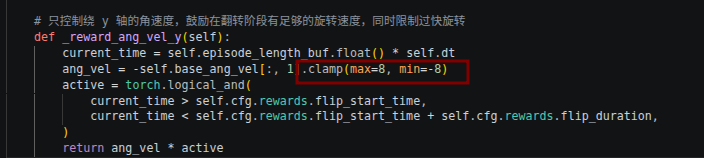

例如起跳高度不足，可增加 z 向起跳速度，鼓励向上跳跃

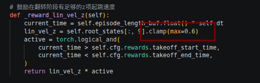

（两个参数需要看实际情况调整，不宜过大或过小）

10. 在 gym 中 play 后可实现翻滚后，可迁移到 mujoco 中，进行 simtosim，基于云深处原生部署框架，进行仿真测试

- a. 添加后空翻状态机

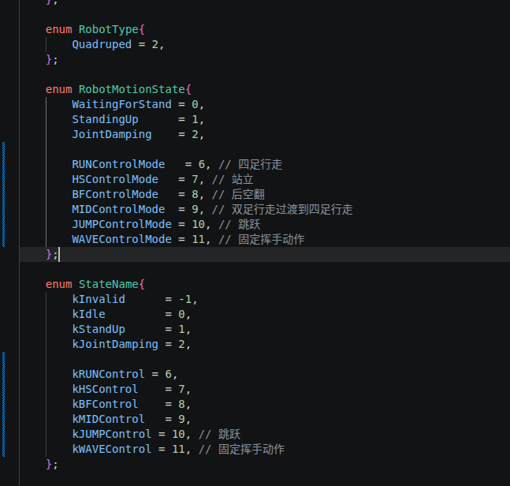

- b. 部署代码实现

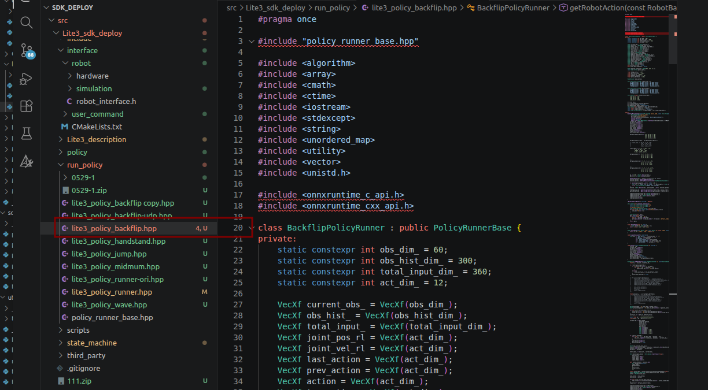

- c. 部署模型导入

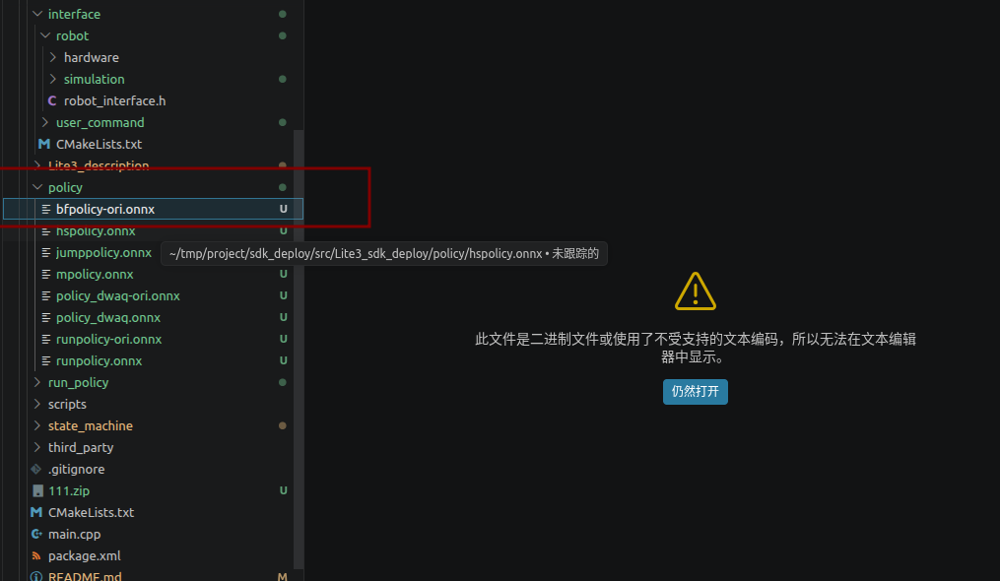

- d. 运行仿真代码，在 mujoco 中切换状态，查看后空翻是否成功

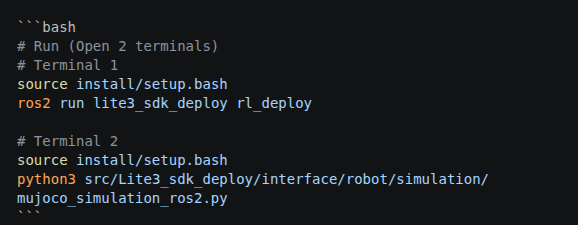

11. 如果在 mujoco 中能够实现后空翻动作，即可以考虑部署到真机，部署代码相同，运行代码改变

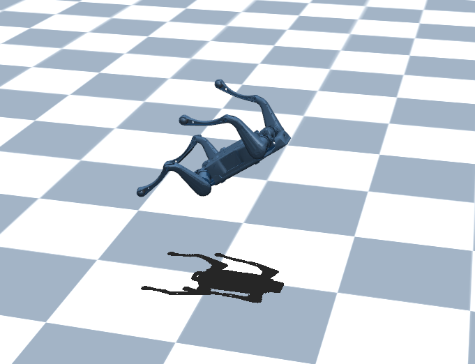

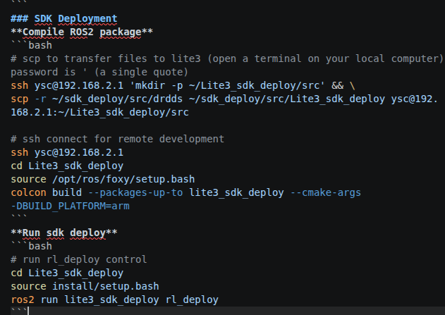

12. 如果 python 中仿真效果无法实现翻滚，大概率会出现起跳前足端与地面接触时滑动，这种情况一般是策略输出的力矩过大，通常调节步骤 9 中的两个参数，适当减小即可，但是减小后也有可能出现翻滚失败的情况，可以考虑增加 config 中的对应奖励函数的权重，需要根据实际情况调整

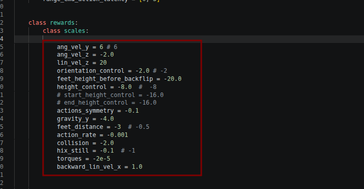

## MuJoCo 仿真背负质量块（与实机盒子对齐）

实机 Lite3 背上有一块控制盒，会改变机身质量和俯仰惯量。后空翻策略按该质量分布训练/在实机可跑时，**未加盒子的 MuJoCo 模型更容易过翻**。不要把盒子质量直接加进 `TORSO` 的 `mass`，也不要改 URDF（本仓库仿真加载的是 MJCF）。

### 模型位置与几何

文件：`Lite3_description/lite3_mjcf/mjcf/Lite3.xml`  
在 `TORSO` 下增加独立子 body `PAYLOAD_BOX`（狗背正中，不并入机身惯性）：

| 项 | 取值 |
|----|------|
| 位置（相对 TORSO） | `pos="0 0 0.08"`（背上） |
| 外形 | 长 **19 cm** × 宽 **13 cm** × 高 **6 cm** |
| MuJoCo `geom` half-size | `0.095 0.065 0.03`（仅视觉，`class="visual"`，不额外碰撞） |
| 质量 | **1.0 kg** |
| 惯量 | `diaginertia="0.19133 0.37053 0.49467"`（约 **112×** 同尺寸均质盒，见下） |
| 机身本体（未含盒子） | `TORSO` mass = 5.6056 kg，保持不变 |

### 扫参记录（MuJoCo `rl_sim`，`OHDOG_SCHEDULE=bf_tune`）

判定要对准**首次触地**（BF 开始后约 2.0 s，即全局 t≈15 s），看机身俯仰 / `fwd_up`（body +x · world +z）。不要用翻完后几秒的 `up_z≈1`：过翻成「屁股着地、头朝上」后会塌成低趴，晚期 `up_z` 仍接近 1，会误判为成功。

| 配置 | 触地 pitch / `fwd_up` | 观感 |
|------|----------------------|------|
| 均质盒 0.5–5 kg（kI=1） | ≈ −70° / 0.94 | 过翻约 π/2，坐姿 |
| 仅加质量或后移质心 | 约 −5°/kg，到 5 kg 仍约 −46° | 不够 |
| **1 kg + kI≈112** | ≈ −13° / 0.22 | **四足蹲姿落地**（随后 default_a 保蹲） |
| 1 kg + kI≳140 | 正向俯仰增大 | 欠翻 |

结论：外形按实机 19×13×6；**只改质量、保持均质惯量无法消掉额外 π/2**。当前默认用 1 kg，并把 `diaginertia` 放大到闭环扫参得到的量级，使触地俯仰接近 0。实机盒子若称重不是 1 kg，可改 `mass` 后用 `scripts/tune_payload_mass.py` 再扫惯量倍率。

闭环扫参脚本：`scripts/tune_payload_mass.py`（`bf_tune` 日程，改 `PAYLOAD_BOX` 的 inertial）。

## 二、trot 步态

1. 基本参数配置与后空翻一致
2. 观测构建函数更改，增加相位观测，使机器人能够根据时间判断抬哪条腿

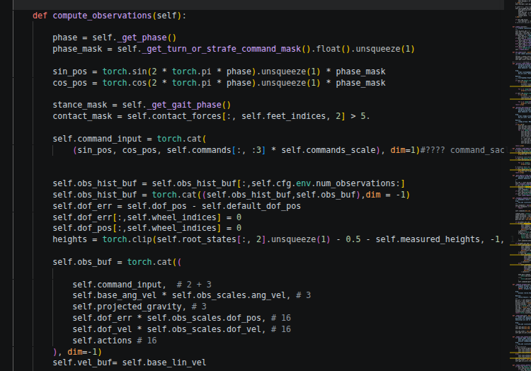

3. 增加相位相关奖励函数，使观测值生效

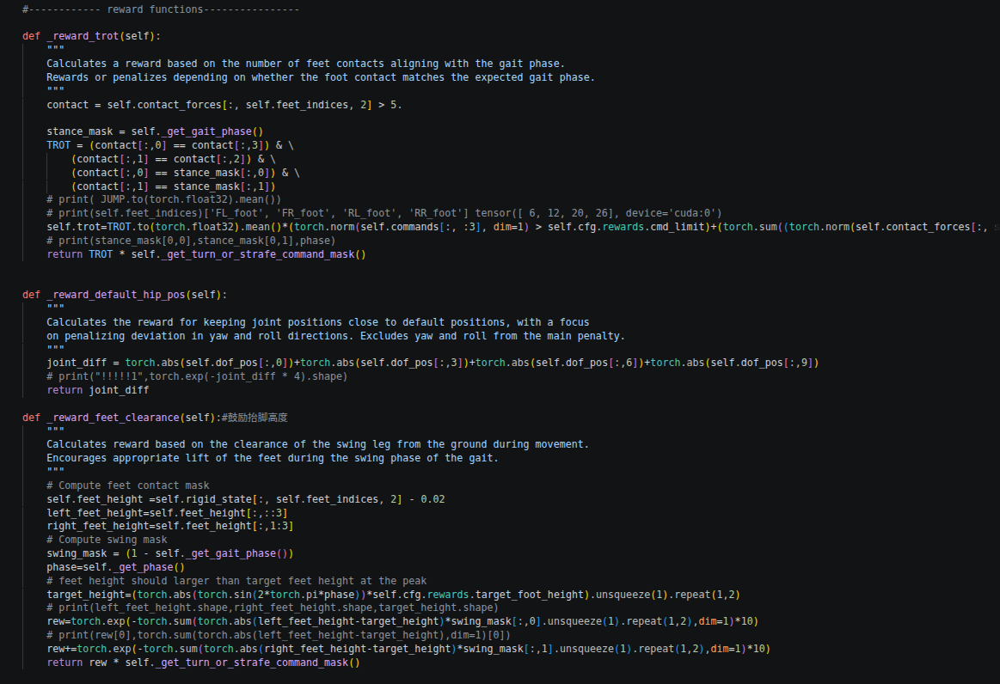

4. 后续同后空翻中，迁移到 mujoco 中看仿真效果，如果效果好，就迁移到真机

---

# 第二部分：Dreamwaq / Lite3 概念笔记


> 整理自 Dreamwaq_Lite3 / lite3_backflip 相关开发与概念讨论。  
> 适用：`Dreamwaq_Lite3` + Isaac Gym + PPO (ActorCritic_DWAQ)。

---

## 1. 项目与配置关系

### 1.1 三套代码不要混用

| 来源 | 观测维度 | 说明 |
|------|----------|------|
| **Dreamwaq 默认** | actor obs **45** | `legged_robot.py` 的 `compute_observations` |
| **Lite3_asset** | actor obs **117** | 含关节/动作历史，需单独实现 |
| **Genesis-backflip** | ~**60** | 含相位 sin/cos，后空翻专用 |

`lite3_config.py` 若写 `num_observations = 117`，但 Dreamwaq 实际只拼 **45** 维，会在加噪声时报错：

```text
RuntimeError: The size of tensor a (45) must match the size of tensor b (117)
```

**结论**：Dreamwaq 训练应设 `num_observations = 45`，与 `compute_observations` 一致。

### 1.2 Dreamwaq 45 维 obs 构成

```text
角速度(3) + 投影重力(3) + 命令(3) + 关节角相对默认(12) + 关节速(12) + 当前动作(12) = 45
```

### 1.3 num_obs 决定什么

- `obs_buf` 形状：`(num_envs, num_obs)`
- `obs_hist_buf`：`(num_envs, num_obs_hist × num_obs)`
- Actor 输入维度、CENet 输入 `num_obs_hist × num_obs`
- DWAQ decoder 输出写死 **45**；PPO 中 `vel_target = prev_critic_obs[:, 45:48]` 假设 privileged 第 45–47 维为线速度

### 1.4 配置字段注意

| 配置项 | lite3_config 常见写法 | 代码实际读取 |
|--------|----------------------|--------------|
| `num_observation_history = 40` | 40 | **`num_obs_hist`**（基类默认 **5**） |
| `num_privileged_obs = 54` | Lite3_asset | Dreamwaq plane 实际约 **100** |

---

## 2. 奖励函数（lite3_backflip）

### 2.1 与 Genesis 的对照

`Lite3Backflip` 中四项奖励在 **Genesis-backflip** 有对应思路；Genesis `Go2` 类不含 `stumble` / `stand_still` / `feet_velocity` / `episode_length`。

子类 `Lite3BackflipCfg.rewards.scales` **继承**父类：scale=0 的项不参与；非零项必须有 `_reward_*` 实现。注意父类若仍为非零的 `torques`、`action_rate`，需显式置 0，否则可能缺函数报错。

### 2.2 奖励与 obs 的关系

- **奖励不读 `obs_buf`**，读仿真状态：`root_states`、`base_ang_vel`、`projected_gravity` 等。
- **与 obs 语义可重叠**（如 `projected_gravity` 也在 obs 里），但奖励用 **真值、物理单位、无 obs 噪声**。
- **与 `num_obs` 无关**；改 obs 维度不必改奖励函数。

### 2.3 后空翻四项（`lite3_backflip.py`）

| 奖励 | 主要输入 |
|------|----------|
| `_reward_orientation_control` | `projected_gravity` vs 时间相位目标姿态 |
| `_reward_ang_vel_y` | `base_ang_vel[:, 1]` + 翻转时间窗 |
| `_reward_ang_vel_z` | `base_ang_vel[:, 2]` |
| `_reward_lin_vel_z` | `root_states[:, 9]` + 起跳时间窗 |

---

## 3. 观测、噪声与 privileged

### 3.1 「原始量」≠ 去噪后的 obs

| | 仿真原始量 | obs_buf |
|--|-----------|---------|
| 来源 | PhysX tensor | 选子集 + 缩放 + 拼命令/动作 |
| 噪声 | 无（奖励/Critic 侧） | 训练时可加噪声 |
| 示例 | z 线速度在 `root_states` | 45 维 actor obs **不含**线速度 |

### 3.2 为何 obs 加噪、奖励不加噪

- **obs 噪声** ≈ 传感器噪声，让策略适应 deploy 时不完美的读数。
- **奖励用真值**：任务目标应稳定；若 reward 也随噪声抖，信用分配会变差。
- **分工**：Actor 看带噪 obs；Critic / reward 用更准确的信息（asymmetric training）。

噪声只在 `compute_observations` 末尾加在 **`obs_buf`** 上；`privileged_obs_buf` 在加噪前拼接，基本无这层人为噪声。

### 3.3 privileged_obs 是什么、谁在用

**privileged_obs（特权观测）** = 训练时 **Critic 专用**的「加强版状态」：比 Actor obs **更全、更准**，部署时 **不用**。

Dreamwaq 拼接（`legged_robot.py`，在 `obs_buf` **加噪之前**）：

```text
privileged_obs = cat(
  obs_buf(45),           # 未加噪的 actor 观测内容
  base_lin_vel(3),       # actor obs 里没有
  contact_forces(51),    # Lite3 约 17 body × 3
  heights(1)             # plane + measure_heights=False 时约 1 维
) ≈ 100 维
```

| 使用者 | 输入 | 作用 |
|--------|------|------|
| **Critic** | `privileged_obs` | 输出 **V**（价值估计） |
| **Actor** | 带噪 `obs` + `obs_hist` | 输出 action（部署只用这条） |
| **CENet 监督** | `prev_critic_obs[:, 45:48]` | 用 privileged 里的 **真值线速度** 监督速度估计 |

Critic 用的是仿真 **真值侧**信息（无 actor 那层传感器噪声），与 reward 用真值打分是同一套 **asymmetric training** 思路；但 Critic 吃 **向量状态**，reward 吃 **标量分数**。

配置 `num_privileged_obs = 54`（Lite3_asset）会导致 Critic 维度错误：

```text
RuntimeError: mat1 and mat2 shapes cannot be multiplied (4096x100 and 54x512)
```

**修复**：`num_privileged_obs` 与 `privileged_obs_buf.shape[-1]` 一致（plane 约 **100**）。

---

## 4. PPO / Dreamwaq 训练流程

### 4.1 数据流概览

```text
Rollout（权重不变）:
  带噪 obs + obs_hist → Actor → 采样 action → 仿真 → reward r → 存入 buffer

Rollout 后:
  r + value → GAE → advantage A

Update:
  loss = f(A, log π_new, log π_old) + value_loss + autoenc_loss
  backward → optimizer.step() 同时更新 W, b, σ, Critic, CENet
```

- **r 不直接进网络**；经 **A** 进入 policy loss。
- **不是**一步 reward 更新一次；每 iteration 约 `4096×24` 条 transition，再 5 epoch × 4 mini-batch 更新。

### 4.2 训练规模（4090 单卡参考）

- `num_envs=4096`, `num_steps_per_env=24`, `max_iterations=5000`
- 约 **5–8 小时**（视 GPU 与负载）
- 命令行应使用 `--max_iterations`（带 s）

### 4.3 命令

```bash
python legged_gym/scripts/train.py --task=lite3_backflip --headless --max_iterations 5000
```

---

## 5. 策略 = 概率分布

### 5.1 高斯策略

```text
obs (+ obs_hist) → Actor → μ（12 维，前向结果，非 Parameter）
self.std → σ（12 个 nn.Parameter，不随 obs 变，会训练）
a ~ Normal(μ, σ)；训练 sample()，部署常用 act_inference() 只取 μ
```

- **π_θ(a|obs)** = 12 维独立高斯的联合密度。
- **log_prob(a)** = 该 action 在当前 μ、σ 下的 log 密度；PPO 核心量之一。

### 5.2 μ 与 σ 的梯度

| | μ | σ |
|--|---|---|
| 是否 Parameter | 否（Actor 输出） | 是（`nn.Parameter`） |
| 如何更新 | ∂L/∂μ → ∂L/∂W, ∂L/∂b | ∂L/∂σ 直接更新 |

同一次 `backward()` 在同一点 θ 上算所有偏导，**一次 `optimizer.step()` 同时更新** W、b、σ 等。

### 5.3 为何需要 σ

- 定义分布与 **log π**；训练时 **探索**（sample 不同 action）。
- 不是固定常数；训练后常 **变小**。

---

## 6. r、V、return、A 四者关系

### 6.1 分别是什么、谁算的

| 符号 | 谁算 | 是什么 |
|------|------|--------|
| **r** | **环境** `_reward_*`（**不是 Actor**） | 执行 action 后的 **即时**标量分 |
| **V** | **Critic** `evaluate(privileged_obs)` | **猜**「从这步起未来折扣 reward 总和」 |
| **return** | 算法 `compute_returns()`（GAE） | 用 **真实 r 序列 + 存的 V** 反推的「实际未来总回报」 |
| **A** | `advantages = returns - values` | **return − V**：这 action **比预期**好/差多少 |

**r 绝不来自 Actor**；Actor 只输出 action。reward 是环境对仿真真值的打分。

### 6.2 为何不能只用 r、需要 V

- **单步 r 短视**：后空翻蹲低时 r 可能低，但是为后面起跳；单看 r 会不愿蹲。
- **V 当 baseline**：状态已经很好时 r 仍高，但 A≈0（action 并不特别神）；状态差但 action 救场时 r 负而 A 正。
- **V 不保证全局最优**，只是帮 **信用分配**（这一步对 **后面** 好结果有多少贡献）并 **降方差**。

### 6.3 完整数值例子（3 步 rollout，γ=1 简化）

| 步 t | Critic 输出 V | 环境 r | return（r 向后累加） | A = return − V |
|------|---------------|--------|----------------------|----------------|
| 0 | 5 | +1 | 1+2+10 = **13** | **+8** |
| 1 | 4 | +2 | 2+10 = **12** | **+8** |
| 2 | 3 | +10 | **10** | **+7** |

- **return** 只在 **rollout 结束后算 1 次**（真实 PPO 用 GAE，含义相同）。
- **A > 0** → 提高该步 action 概率；**A < 0** → 降低。

### 6.4 reward 如何影响训练（不进网络输入）

```text
r → 存 buffer → compute_returns → return, A
                    ↓
    policy loss（A 加权 log π）→ 更新 Actor + σ
    value loss（return 当 target）→ 更新 Critic
    autoenc loss → 更新 CENet（不直接来自 r）
```

**网络前向都不拼接 r**；r 是 **训练信号 / 标签**，经 return/A 进入 loss。

Policy loss（最小化，等价于最大化 A×log π）：

```text
loss_policy ≈ -A × ratio，  ratio = π_new / π_old
```

---

## 7. 一次 iteration 的时间线

### 7.1 三个阶段

```text
阶段 A — Rollout（每个 env 24 次 env.step，4096 并行；权重不变）
  每步：Critic 前向 → V；Actor 路径前向 → action；环境 → r
  全部存入 buffer

阶段 B — Rollout 结束（只 1 次）
  compute_returns(last_critic_obs)：r 序列 + 存的 V → return, A

阶段 C — Update（5 epoch × 4 mini-batch ≈ 20 次）
  用 buffer 里固定的 return、A 训练
  每个 mini-batch 再算新 Critic 前向 → value loss
  backward + optimizer.step()
```

### 7.2 V 和 return 何时计算

| | **V** | **return** |
|--|-------|------------|
| Rollout 每步 | ✅ Critic 前向（旧权重） | ❌ |
| Rollout 结束 | 用于 GAE 补尾 | ✅ **算 1 次** |
| Update 每 batch | ✅ 再算（新权重，value loss） | ❌ 复用 buffer，不重算 |

### 7.3 「步」指什么

- **1 步** = 1 次 RL 的 **`env.step(action)`**（策略决策间隔）。
- 内部 `decimation=4`：同一 action 下 PhysX 仿真 4 次；控制频率约 50Hz。
- **不是** PPO update 的「步」，也 **不是** 仅 1 次网络前向。

### 7.4 每个 env.step 里的网络前向

**Actor 与 Critic 是两个独立 MLP**（`ActorCritic_DWAQ` 里还有 **CENet** 在 Actor 路径上）：

| 网络 | 每 env.step 前向次数 | 输入 | 输出 |
|------|---------------------|------|------|
| **Critic** | **1 次** | privileged_obs | V |
| **Actor 路径** | **1 次**（CENet 编码 + Actor MLP） | obs + obs_hist | action |

合起来 **每仿真步 2 条独立前向**（Critic 1 + Actor 路径 1）；**r 由环境算，不是前向结果**。

`ppo.act()` 顺序：`evaluate(critic_obs)` → `act(obs, obs_hist)` → `env.step(actions)`。

---

## 8. 策略、log_prob 与 loss 符号

### 8.1 高斯策略再述

- 前向只算出 **μ**（12 维）；**σ** 是 `nn.Parameter`（12 个可学习标量，不随 obs 变）。
- 分布由 **算法规定** `Normal(μ, σ)` 拼成；`sample()` 得 action，`log_prob(a)` 得 log π。

### 8.2 log_prob 的作用

`log_prob(0.62)` = 在当前 μ、σ 下，action=0.62 的 **log 概率密度**（连续动作是密度，不是百分比）。

- 衡量「当前策略下这次 action 有多常见」。
- PPO 用 **A × log π** 调整策略；**不经过仿真**。

### 8.3 最大化 vs 最小化

- **要最大化**：\(J = A \times \log \pi_\theta(a|obs)\)
- **代码最小化**：\(\text{loss} = -A \times \log \pi\)（Adam 默认最小化 loss）

---

## 9. 梯度与偏导（概念）

- 每次 `backward()` 在 **当前参数点** 求 **梯度向量** \(\nabla_\theta L = (\partial L/\partial W,\, \partial L/\partial b,\, \partial L/\partial \sigma,\, \ldots)\)。
- 求 \(\partial L/\partial \sigma\) 时，式中可出现 μ 的**数值**，但是 **σ 的梯度只更新 σ**；**W、b 走 \(\partial L/\partial \mu\) 链式法则** 另一条路。
- **同一次 backward + 一次 optimizer.step() 同时更新所有 Parameter**（含 `self.std`）。
- **梯度下降**：\(\theta \leftarrow \theta - \eta \nabla L\)，不是联立 \(\partial L/\partial \theta = 0\) 求解析最优。
- **仿真不参与反传**；buffer 里的 r、A、action 在 update 时作常数。

### 9.1 极简 1 维玩具例子

```text
μ = W·obs + b，  a ~ N(μ, σ)，  执行 a=0.62 → 环境 → r →（rollout 后）A=+2

Update:
  log π = log N(0.62; μ, σ)
  loss = -A × log π
  backward → W.grad, b.grad, σ.grad 各自独立
  optimizer.step()
```

---

## 10. 常见报错速查

| 报错 | 原因 | 处理方向 |
|------|------|----------|
| obs 45 vs 117 | `num_observations` 与 `compute_observations` 不一致 | 设 `num_observations = 45` |
| Critic 4096×100 vs 54×512 | `num_privileged_obs` 与实际 privileged 维不一致 | 设约 **100**（或 print shape 确认） |
| 缺 `_reward_*` | scales 非零但环境未实现 | 子类置 0 或实现函数 |

---

## 11. 部署时的策略

```text
obs, obs_hist → CENet → code
code + obs → Actor → μ（12 维）→ action
```

无 reward 输入；checkpoint 存的是整网 θ，不是闭式公式。

---

## 12. 训练曲线：导出与查看 PNG

### 12.1 日志在哪里

```text
Dreamwaq_Lite3/legged_gym/logs/backflip_lite3/<run名>/
├── events.out.tfevents.*   # TensorBoard 二进制（勿当文本打开）
├── model_*.pt              # checkpoint
└── plots/                  # plot_tb.py 生成的 PNG（运行脚本后才有）
```

### 12.2 导出 PNG

```bash
conda activate OHD
cd Dreamwaq_Lite3

python tool/plot_tb.py legged_gym/logs/backflip_lite3/<run名>
# 输出到 legged_gym/logs/backflip_lite3/<run名>/plots/
```

脚本路径：`Dreamwaq_Lite3/tool/plot_tb.py`。更多参数见训练 guide §7.3。

### 12.3 怎么「读」这些图

**Cursor Remote SSH（推荐）**：文件树打开 `.../plots/Train_mean_reward.png`，单击即可在编辑器里预览。

**拷到本地 Windows**：

```bash
scp -r snh@<服务器IP>:~/code/OHDog/Dreamwaq_Lite3/legged_gym/logs/backflip_lite3/<run名>/plots ./
```

本地资源管理器双击 PNG 查看。

**读图要点**

| PNG | 含义 |
|-----|------|
| `Train_mean_reward` | reward 趋势；后空翻可看是否学会有起跳/翻转 |
| `Train_mean_episode_length` | 是否频繁提前摔倒 |
| `Loss_*` | 是否发散（NaN 前常 spike） |
| `Policy_mean_noise_std` | 探索程度 |

`tfevents` 不能当图片看；`model_*.pt` 不能当图片看，需 play 或 `torch.load`。

---

## 13. 相关文件路径

| 内容 | 路径 |
|------|------|
| Lite3 配置 | `Dreamwaq_Lite3/legged_gym/legged_gym/envs/lite3/lite3_config.py` |
| 后空翻环境与奖励 | `Dreamwaq_Lite3/legged_gym/legged_gym/envs/lite3/lite3_backflip.py` |
| obs / reward 实现 | `Dreamwaq_Lite3/legged_gym/legged_gym/envs/base/legged_robot.py` |
| DWAQ 策略网络 | `Dreamwaq_Lite3/rsl_rl-1.0.2/rsl_rl/modules/actor_critic_DWAQ.py` |
| PPO | `Dreamwaq_Lite3/rsl_rl-1.0.2/rsl_rl/algorithms/ppo.py` |
| Runner | `Dreamwaq_Lite3/rsl_rl-1.0.2/rsl_rl/runners/on_policy_runner.py` |
| Rollout storage / GAE | `Dreamwaq_Lite3/rsl_rl-1.0.2/rsl_rl/storage/rollout_storage.py` |
| 训练曲线导出脚本 | `Dreamwaq_Lite3/tool/plot_tb.py` |
| Genesis 奖励参考 | `Genesis-backflip/reward_wrapper.py` |

---

## 14. 概念速记（一句话）

| 概念 | 一句话 |
|------|--------|
| **r** | 环境每步即时打分，经 return 影响训练，不进网络输入 |
| **V** | Critic 对「这状态未来总共多少分」的猜测 |
| **return** | 用真实 r 序列算出的「实际未来总回报」，每 iteration 算 1 次 |
| **A** | return − V，告诉 Actor 这 action 比预期好/差多少 |
| **privileged_obs** | Critic 输入，仿真真值侧、比 actor obs 更全 |
| **一步** | 一次 `env.step()`；Critic 1 前向 + Actor 路径 1 前向 + 环境出 r |
| **π_θ** | 高斯策略；μ 由 Actor 算，σ 是 Parameter |
| **log_prob** | 已执行 action 在当前分布下的 log 密度，供 PPO 更新 |

---

*文档生成日期：2026-06-29；增补训练曲线 PNG 导出与查看（§12）*
